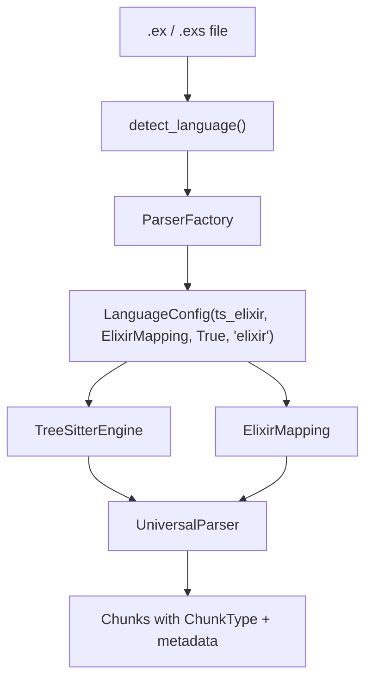

# Design Document: Elixir Language Support

## Overview

Add Elixir as a first-class language to ChunkHound's Tree-sitter parsing pipeline. Follows the established `BaseMapping` pattern using `lua.py` as the structural template. The core challenge is that Elixir's Tree-sitter grammar represents all constructs as `call` nodes — pattern matching on identifier text (`defmodule`, `def`, etc.) is required to classify chunks.

## Architecture



## Components and Interfaces

### 1. ElixirMapping (`chunkhound/parsers/mappings/elixir.py`)

Extends `BaseMapping`. Implements `get_query_for_concept()` with Tree-sitter S-expression queries using `#match?` and `#any-of?` predicates against `call` node target identifiers.

```python
class ElixirMapping(BaseMapping):
    def __init__(self) -> None:
        super().__init__(Language.ELIXIR)

    def get_query_for_concept(self, concept: UniversalConcept) -> str | None: ...
    def extract_name(self, concept, captures, content) -> str: ...
    def extract_content(self, concept, captures, content) -> str: ...
    def extract_metadata(self, concept, captures, content) -> dict[str, Any]: ...
    def get_function_query(self) -> str: ...
    def get_class_query(self) -> str: ...
    def get_comment_query(self) -> str: ...
    def extract_function_name(self, node, source) -> str: ...
    def extract_class_name(self, node, source) -> str: ...
```

### 2. Language Enum Extension (`common.py`)

Add `ELIXIR = "elixir"` with `.ex`/`.exs` extensions and `is_programming_language = True`.

### 3. ParserFactory Registration (`parser_factory.py`)

Direct import `import tree_sitter_elixir as ts_elixir` (standalone PyPI package, same pattern as Haskell). Add `LanguageConfig` and extension mappings.

## Design Decisions

### Decision 1: Use `#match?` predicates on `call` node targets

**Rationale:** Elixir's Tree-sitter grammar has no dedicated node types for `defmodule`, `def`, etc. — everything is a generic `call` node. The keyword appears as `(identifier)` text inside the call's target. Using `#match?` predicates is the canonical tree-sitter approach for text-based filtering.

**Approach:** Each concept query matches `(call target: (identifier) @keyword (#match? @keyword "^def$|^defp$")) @definition` patterns. Group related keywords per concept.

**Validates:** Requirements 2.1-2.4, 3.1-3.5, 5.1

### Decision 2: Nested name extraction for functions

**Rationale:** In Elixir AST, `def foo(a, b)` produces `call[target: "def"] → arguments → call[target: "foo"]`. The function name is the inner call's target identifier, not a direct child.

**Approach:** Navigate `arguments → first call child → target identifier` to extract the function name. Fall back to `arguments → first identifier` for zero-arity functions.

**Validates:** Requirements 3.5, 2.4

### Decision 3: `@doc`/`@moduledoc` as comments via `unary_operator`

**Rationale:** Module attributes like `@doc` and `@moduledoc` are parsed as `(unary_operator operator: "@" operand: (call target: (identifier)))` in the Elixir grammar. They're semantically documentation, not code.

**Approach:** The COMMENT concept query matches both `(comment)` nodes (for `# line comments`) and `unary_operator` nodes with `@doc`/`@moduledoc` targets.

**Validates:** Requirements 6.1, 6.2

### Decision 4: Direct PyPI import (no language pack wrapper)

**Rationale:** `tree-sitter-elixir` is a standalone PyPI package (`>=0.3.4`), actively maintained. Same pattern as `tree-sitter-haskell`. No need for the language-pack wrapper complexity.

**Approach:** `import tree_sitter_elixir as ts_elixir` at module level, `LanguageConfig(..., True, "elixir")` — always available.

**Validates:** Requirements 1.1, 1.2

## Correctness Properties

### Property 1: File Extension Recognition
*For any* file with `.ex` or `.exs` extension, when language detection runs, the system SHALL identify it as `Language.ELIXIR`.
**Validates: Requirements 1.1, 1.2**

### Property 2: Keyword-to-ChunkType Mapping
*For any* Elixir source containing `defmodule`/`def`/`defp`/`defmacro`/`defprotocol` calls, when parsed, the system SHALL emit chunks with the correct `ChunkType` and metadata `kind`.
**Validates: Requirements 2.1-2.3, 3.1-3.4**

### Property 3: Name Extraction Accuracy
*For any* function definition `def foo(...)`, when the name is extracted, the system SHALL return `"foo"` (not `"def"` or the full call text).
**Validates: Requirements 3.5, 2.4**

### Property 4: Attribute Recognition
*For any* `@spec`, `@type`, `@callback`, `@doc`, or `@moduledoc` attribute, when parsed, the system SHALL emit a chunk of the appropriate type (TYPE or COMMENT).
**Validates: Requirements 4.1-4.3, 6.1-6.2**

## File Changes

| Change | File | ~Lines | Description |
|--------|------|--------|-------------|
| Create | `chunkhound/parsers/mappings/elixir.py` | ~350 | ElixirMapping class with all concept queries |
| Modify | `chunkhound/core/types/common.py` | ~10 | Add `ELIXIR` enum, extensions, `is_programming_language` |
| Modify | `chunkhound/parsers/parser_factory.py` | ~5 | Import ts module, add config + extension entries |
| Modify | `chunkhound/parsers/mappings/__init__.py` | ~3 | Import and export ElixirMapping |
| Modify | `pyproject.toml` | ~1 | Add `tree-sitter-elixir>=0.3.4` dependency |
| Create | `tests/test_elixir_parser.py` | ~150 | Parser tests with inline Elixir snippets |
| Create | `tests/fixtures/elixir/comprehensive.ex` | ~100 | Representative Elixir fixture |
| Modify | `tests/test_smoke.py` | ~5 | Add ELIXIR smoke test sample |

## Testing Strategy

### Unit Tests
1. **File detection** — `.ex` and `.exs` resolve to `Language.ELIXIR`
2. **Module parsing** — `defmodule`, `defprotocol`, `defimpl` emit correct chunk types
3. **Function parsing** — `def`, `defp`, `defmacro`, `defguard`, `defdelegate` emit correct types with accurate names
4. **Type/spec parsing** — `@spec`, `@type`, `@callback` emit `ChunkType.TYPE`
5. **Import parsing** — `use`, `import`, `alias`, `require` emit `ChunkType.IMPORT`
6. **Comment parsing** — `# comments` and `@doc`/`@moduledoc` emit `ChunkType.COMMENT`

### Integration Tests
1. **Comprehensive fixture** — Parse `comprehensive.ex` (GenServer, protocol+impl, LiveView) and verify chunk counts and types

### Smoke Tests
1. **Regression guard** — `Language.ELIXIR` sample in `test_smoke.py` parses without error

## Error Handling

### Missing tree-sitter-elixir package
When `import tree_sitter_elixir` fails:
- Direct import at module level — if missing, `ImportError` at startup
- Clear error: `SetupError` with `install_command="pip install tree-sitter-elixir"`

### Unrecognized AST structure
When an Elixir construct doesn't match any query pattern:
- Falls through to `None` return — no chunk emitted (safe default)
- No crash, just a gap in coverage

## Risk Assessment

| Risk | Likelihood | Impact | Mitigation |
|------|------------|--------|------------|
| Multi-clause functions produce duplicate chunks | Medium | Low | cAST greedy merge handles adjacent same-name defs; verify empirically |
| `#match?` predicate performance on large files | Low | Low | Same pattern used by GitHub for syntax highlighting at scale |
| `tree-sitter-elixir` API incompatibility | Low | Medium | Pin `>=0.3.4`, test in CI |

## Implementation Sequence

### Phase 1: Infrastructure
1. Add `tree-sitter-elixir` dependency to `pyproject.toml`
2. Add `ELIXIR` to Language enum with extensions
3. Register in `parser_factory.py` and `mappings/__init__.py`

### Phase 2: Core Parser
4. Create `ElixirMapping` with all concept queries and extraction logic

### Phase 3: Testing
5. Create fixture file and parser tests
6. Add smoke test entry
7. Run full verification suite
